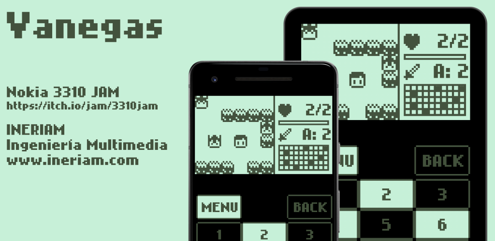

# Vanegas

Defeat the six powerful guardians to free the people of Vanegas from the fearsome monsters.

Your mission is to guide a young warrior through a large map, to locate and fight against the guardians, but be careful, as a group of monsters will do the impossible to avoid your goal.

🎮 Control settings:
* Key M | Key SPACE: Return to the main menu screen
* Key B | Key BACK key: Return to the previous screen
* Key W | Key DPAD UP: Move the young warrior one position up
* Key A | Key DPAD LEFT: Move the young warrior one position to the left
* Key ENTER: Confirm action
* Key D | Key DPAD RIGHT: Move the young warrior one position to the right
* Key S | Key DPAD DOWN: Move the young warrior one position down

🎮 On-screen control settings:
* MENU key: Return to the main menu screen
* BACK key: Return to the previous screen
* Key 2: Move the young warrior one position up
* Key 4: Move the young warrior one position to the left
* Key 5: Confirm action
* Key 6: Move the young warrior one position to the right
* Key 8: Move the young warrior one position down

⚔ Combat mechanics
You can only move one direction at a time. When making a move, the monsters or guardians will also advance towards your location. To inflict damage on enemies, your next move must be such that there is no space or space between the player and the enemy. If the movement you made places you in a position next to an enemy, it will attack the player.

❤ Level up
You can level up by defeating monsters and guardians, gaining combat (A) and health (HP) experience.
Every certain time, the enemies show their level of health and the damage they inflict.

💾 Save progress
The game automatically saves your progress. If you lose in combat, you will appear again in the same area of the map where you fought for the last time.

This game is the participation of INERIAM Ingeniería Multimedia in the Nokia 3310 JAM.
For more information: https://itch.io/jam/3310jam

The game was developed with libGDX.

Thanks for downloading the game!

INERIAM Ingeniería Multimedia
http://www.ineriam.com

Contact:
✉ info@ineriam.com
